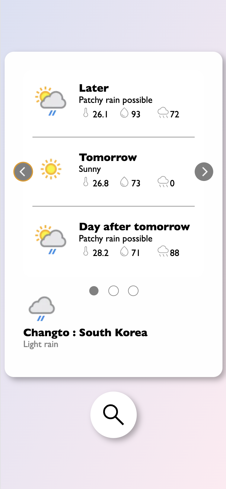
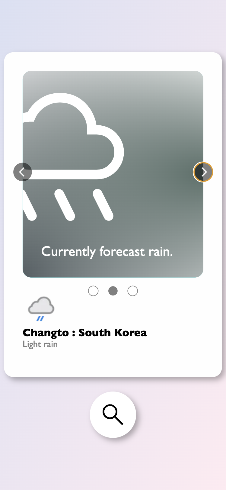
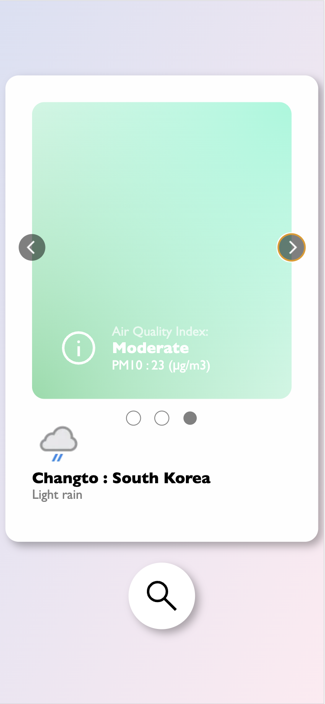

# 🌧️   Weather-App
A small app to retrieve the weather in a part of the world.
Includes a three day forecast, rain and weather alerts, and an air quality index tab.

## Live [Weather App](https://github.com/niallantony/Weather-App)

Part of TheOdinProject as an exercise to practice asynchronous functions, and APIs. Also showing off a few modules of my own making for a hidden search bar and image carousel.

## Screenshots

    
    
    

## Personal Objectives

- **Understand and use asynchronous functions, with Promises and await/async.** I wanted to actually use both of these formats so that I could see how either works, anyway the way I understand it *async/await* is just an abridged way of working with promises (Maybe not but thats the way I tried to understand it). Still a lot to try to understand but the basics are there.

- **Use modular elements that I created in a separate project** I have been maintaining a small repository where I store a number of different elements I created from scratch, mainly for practice, but it was nice to use some of them in a project. I took the carousel from there, and created the search button especially for this project but added it to there so I can use it again maybe. Keeping a library of these modules and expanding it is something that I look forward to!

- **Practice good OO principals** While in my last project I focussed on having each module loosely coupled, I think I overworked it (to see that project see: [To Do List](https://github.com/niallantony/ToDoList)) with a PubSub pattern (even though I learnt a lot from making one), in this project I think I maintained a more pragmatic approach to loosely coupling modules as well as making sure functions have one task (which I might have broke in a few places). I feel a lot happier with the code in this project, even though there are definitely improvements to be made.

- **Continue learning to use webpack** I wanted to make it a personal goal to broaden my understanding of Webpack and keep using it in my projects. In this project I am happiest with my use of it to bundle assets, multiple css files, and my different modules.

## Possible Improvements

- **Better folder management** Modules in modules, styles in styles, etc...

- **DOM management** I still am not so happy with handling of DOM elements, I don't quite know what I mean by that, but it just feels like theres a less clumsy way to handle it.
